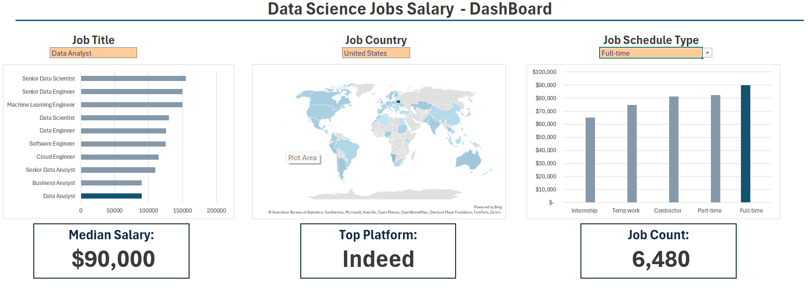

# Data Analyst Jobs Salary Dashboard

An interactive Excel dashboard analyzing global data science and data analyst job postings, built to explore salary trends across countries, job titles, and role types.

## Dashboard Preview

## Overview
This project uses a dataset of 1000+ real job postings scraped from multiple job platforms across various countries. The dashboard allows users to dynamically filter and explore the data through interactive slicers and charts.

## Features
- Salary comparison by job title (Data Analyst, Data Scientist, Data Engineer, etc.)
- Country-by-country salary breakdown
- Filters by job schedule type (Full-time, Part-time, Contract)
- Dynamic charts that update based on slicer selections

## Tools Used
- Microsoft Excel (PivotTables, Slicers, Charts)

## Dataset
The dataset includes the following fields: job title, company, location, country, salary (annual/hourly), required skills, job schedule type, and work-from-home status.
